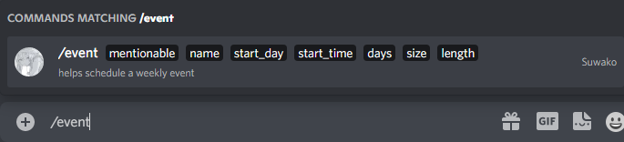
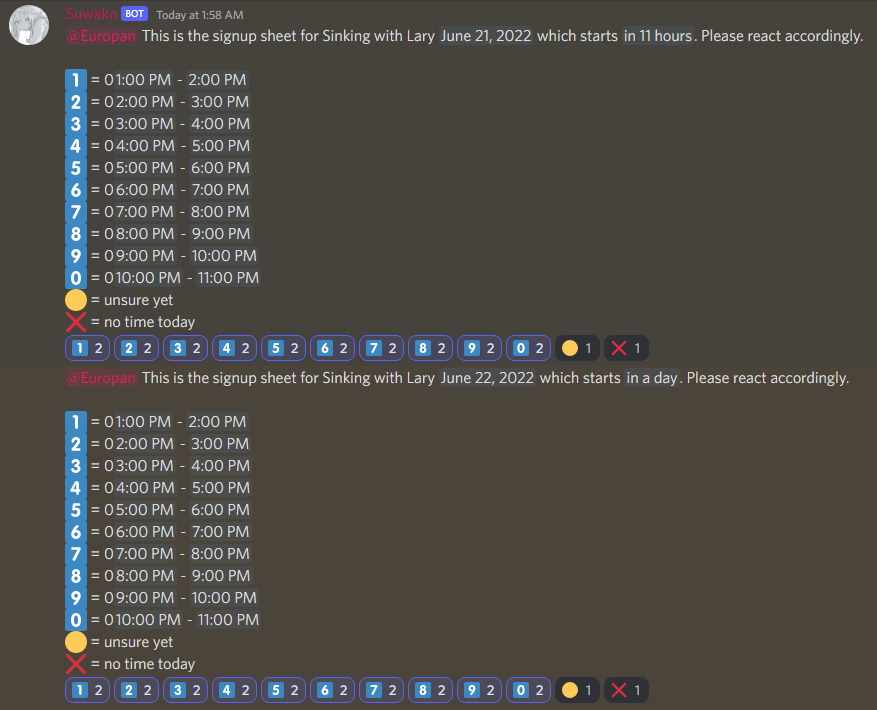

# Discord Weekly Event Bot
## Description
A bot for organizing events at reccuring timeslots for some days of a week. Created following the discord.js tutorial from [here](https://discordjs.guide/).
## Installation
First, create a new folder and download these files to that folder. Next, download node.js and npm using [this tutorial](https://radixweb.com/blog/installing-npm-and-nodejs-on-windows-and-mac#windows). Then open a command prompt inside the bot folder and run:
```
npm init -y
npm install discord.js @discordjs/builders @discordjs/rest discord-api-types
```
Now go th [Discord dev portal](https://discord.com/developers/applications) and create a "New Application." Afterwards, click "Bot" then "Add Bot." Now click "Reset Token" and copy the new key. Next, create a new file in the bot's folder called "auth.json" and type:
```
{
  "clientId": "your bot's application id goes here",
  "token" : "your bot's token goes here"
}
```
Finally, give an adminastrator on the server you want to add it the following link with "123456789012345678" replaced by your bot's clientId. 
```
https://discord.com/api/oauth2/authorize?""&permissions=2147682368&scope=bot%20applications.commands
```
The listed permissions will give a bot its own role with all the necessary permissions already added. The bot can then be regulated by adding another role with no permissions and only giving the role a single view channel permission in channels it is allowed in.
## Running the bot
To update the bot's commands, run the following from a cmd in the the bot's folder:
```
node deploy-commands.js
```
To run the bot use:
```
node main.js
```
To automatically run the bot on startup (Windows 10) create a .bat file in the bot's folder containing:
```
node main.js
```
Then, create a shortcut of it and move it to the folder that opens when you open "shell:startup" from the Run app (just search "run").
## How to use
The bot runs with the "/event" command shown below.

```
mentionable - mention something
name - the name of the event to post for
start_day - what day of the year to start on 'yyyy-mm-dd' local
start_time - what time of the day to start at \'hh:mm\' local
days - which days of the week to repeat for 'smtwhfa'
size - the number of time slots for each day 1-10
length - the number of minutes for each time slot
```
For example: "/event mentionable:@Europan name:Bingus start_day:2022-06-21 start_time:04:20 days:ast size:3 length:20" will start a poll for the Sunday, tHursday, and sAturday closest on/after the start day. Each poll will have 3 options for the 20 mintue timeslot starting at 4:20 and then the next two slots afterward. The poll will be for the event "Bingus" and each day will ping the mentioned group.
## Example Output

## Author
Trevyn Exley
